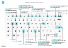

# Referencia rápida de teclado: solo PC

#### General
|Pulsar estas teclas|Para hacer esto|  
|-|-|
|Alt+F2 Alt+N Alt+Mayús+N Alt+O Alt+Q Alt+Arriba Alt+flecha abajo Alt+T Alt+Mayús+W Ctrl+Insertar Ctrl+Supr Ctrl+Shift+F12 Ctrl+F1 Ctrl+Clic Shift+F12 F5/Ctrl+F5 Tab/Mayús+Tab F6/Shift+F6 |Mostrar u ocultar el panel de cuadro informativo Crear un registro nuevo Cerrar un registro recién creado y crear uno nuevo Agregar una nueva nota para el registro seleccionado Abrir **Dígame** Abrir la información sobre herramientas o el error de validación Abrir un menú desplegable o buscar Abrir la página **Mi configuración** Abrir la ficha o documento actual en una nueva ventana Insertar una nueva línea en un documento Eliminar la línea de un documento, diario u hoja de trabajo Maximizar la parte de productos de línea en una página de documento Abrir la ayuda de la página Navegar al personalizar Abrir el explorador de roles, una descripción general de la función Actualizar o volver a cargar la página Desplazar el enfoque al elemento siguiente/anterior Desplazarse a la siguiente ficha desplegable/parte|

#### Desplazarse y seleccionar filas
|Pulsar estas teclas|Para hacer esto|
|-|-|
|Inicio/Fin Ctrl+Inicio/Fin  Ctrl+Flecha arriba/abajo Ctrl+E  Ctrl+Espacio Ctrl/Shift+Clic Mayús+Flecha arriba/abajo Mayús+Av/Re Pág Ctrl+Enter|Ir al primer/último campo Ir a la primera/última fila Desplazarse sin perder la selección Seleccionar todo Alternar la selección de la fila  Agregar la fila o las filas a la selección Agregue una fila arriba/debajo de la selección Seleccionar filas visibles arriba/abajo  Centrarse en la lista|

#### Copiar y pegar
|Pulsar estas teclas|Para hacer esto|
|-|-|
|Ctrl+C/V F8|Copiar/pegar filas Copiar campo de arriba a la fila actual|

#### Buscar, filtrar y ordenar
|Pulsar estas teclas|Para hacer esto|
|-|-|
|Alt+F7 F3 Shift+F3 Ctrl+Shift+F3 Alt+F3 Mayús+Alt+F3 Ctrl+Alt+Mayús+F3|Clasificar la columna en orden ascendente/descendente Búsqueda alternativa Alternar el panel de filtros; centrarse en los filtros de campo Alternar el panel de filtros; centrarse en los filtros de totales Filtrar en el valor de la celda seleccionada Agregar un filtro en el campo seleccionado Restablecer filtros|

#### Entrada rápida
|Pulsar estas teclas|Para hacer esto|
|-|-|
|Ctrl+Mayús+Entrar Entrar/Mayús+Entrar|Ir al siguiente campo de entrada rápida fuera de una lista Ir al campo de entrada rápida siguiente/anterior|

##### Vista preliminar de un informe
|Pulsar estas teclas|Para hacer esto|
|-|-|
|Ctrl+Inicio/Fin|Ir a la primera/última página|

> [!TIP]
> Para obtener una versión gráfica y preparada para imprimir elija la siguiente imagen y descargue el archivo PDF.
>
> 
