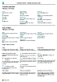

# Trabajar con [!INCLUDE[d365fin](includes/d365fin_md.md)]Working with [!INCLUDE[d365fin](includes/d365fin_md.md)]
Al realizar tareas empresariales, el usuario interactúa con los datos de diferentes maneras; por ejemplo, crear registros e introducir datos, ordenar y filtrar datos, escribir notas y exportando datos a otras aplicaciones.When performing business tasks, you interact with data in different ways, such as creating records and entering data, sorting and filtering data, writing notes, and outputting data to other applications.

Por ejemplo, puede ajustar el tamaño y la posición de cualquier página. Para ello, expanda la anchura de las columnas, aumente la altura de los encabezados de columna y cambie el orden de los datos de las columnas.For example, you can adjust the size and position of any page, expand the width of columns and increase the height of column headers, and change the sorting of data in columns. Y si quiere usar la barra de desplazamiento horizontal para ver todas las columnas en una página de lista o en líneas de documentos, verá que hay una inmovilización del panel vertical para impedir el desplazamiento de algunas columnas.And if you want to use the horizontal scroll bar to view all columns on a list page or on document lines, you will see that there is a vertical freeze pane to restrict some columns from scrolling.

## Sugerencias y trucosTips and Tricks

> [!TIP]
> Para obtener un resumen en versión para imprimir de las funciones más usadas, elija la siguiente imagen y descargue el archivo PDF.For a print-friendly overview of the most used functions, choose the following image and download the PDF file.
>
> 

## Vínculos para obtener más informaciónLinks to Learn More

En la tabla siguiente se indican algunas de las funciones generales con vínculos a los temas en que se describen.The following table lists some of the general functionality with links to topics that describe them.

> [!NOTE]
> Además de las funciones de IU generales descritas en esta sección, puede usar otras funciones generales que estén más relacionadas con el negocio.In addition to the general UI functions described in this section, you can use other general functions that are more business-related. Para obtener más información, consulte [Funciones empresariales generales](ui-across-business-areas.md).For more information, see [General Business Functionality](ui-across-business-areas.md).

| ParaTo  | VeaSee |
| --- | --- |
|Encuentre una página, informe, acción, tema de ayuda o extensión de socio específica.Find a specific page, report, action, help topic, or partner extension. |[Búsqueda de páginas e información con DígameFinding Pages and Information with Tell Me](ui-search.md) |
|Obtenga una descripción general de las páginas para su rol y para otros roles y navegue a las páginas.Get an overview of pages for your role and for other roles and navigate to pages.|[Búsqueda de páginas con el explorador de rolesFinding Pages with the Role Explorer](ui-role-explorer.md)|
| Filtrar los datos de vistas, informes, o funciones con los símbolos y caracteres especiales.Filter data in views, reports, or functions by using special symbols and characters. |[Ordenar, buscar y filtrar listasSorting, Searching, and Filtering Lists](ui-enter-criteria-filters.md) |
|Obtenga información sobre varias funciones generales que le pueden ayudar a introducir datos de manera rápida y fácil.Learn the many general functions that help you enter data in a quick and easy way.|[Introducción de fechasEntering Data](ui-enter-data.md)|
|Obtenga información sobre cómo copiar y pegar datos rápidamente incluido mediante el uso de métodos abreviados de teclado.Learn how to quickly copy and paste data including by using keyboard shortcuts.|[Preguntas frecuentes sobre copiar y pegarCopying and Pasting FAQ](ui-copy-paste.md)|
| Ver o procesar los datos en rangos de fecha específicos.View or process data in specific date ranges. |[Trabajar con fechas y horas del calendarioWorking with Calendar Dates and Times](ui-enter-date-ranges.md) |
| Observe qué campos se deben rellenar.See which fields must be filled in. |[Detección de campos obligatoriosDetecting Mandatory Fields](ui-mandatory-fields.md) |
|Conocer cómo la configuración regional del ordenador afecta la interfaz de usuario y el sitio de Ayuda y cómo cambiar el idioma.Understand how the computer locale affects the user interface and the Help site and how to change the language.|[Cambiar idioma y regiónChanging Language and Locale](about-locale-language.md)|
|Obtenga información sobre cómo interactuar con Excel desde prácticamente cualquier lugar en [!INCLUDE[d365fin](includes/d365fin_md.md)]Learn how to interact with Excel from practically anywhere in [!INCLUDE[d365fin](includes/d365fin_md.md)]|[Ver y editar en ExcelViewing and Editing in Excel](across-work-with-excel.md)|
|Adjunte archivos, agregue vínculos o escriba notas en fichas y documentos.Attach files, add links, or write notes on cards and documents.|[Administrar archivos adjuntos, vínculos y notas en fichas y documentosManage Attachments, Links, and Notes on Cards and Documents](ui-how-add-link-to-record.md)|
| Cambiar la configuración básica como la fecha de trabajo o de la empresa y el área de trabajo.Change basic settings such as company, work date, and Role Center. |[Cambiar la configuración básicaChange Basic Settings](ui-change-basic-settings.md) |
|Recibir notificaciones sobre eventos o cambios en el estado, como cuando está a punto de facturar a un cliente que tiene un saldo vencido.Get notified about certain events or changes in status, such as when you are about to invoice a customer who has an overdue balance.|[Administrar notificacionesManage Notifications](ui-smart-notifications.md)|
| Cambie qué elementos de la interfaz de usuario y dónde se muestran para que se ajusten a sus preferencias.Change which and where UI elements are shown to fit your preferences.|[Personalizar el área de trabajoPersonalize Your Workspace](ui-personalization-user.md) |
|Definir, previsualizar, imprimir o guardar los informes y definir y ejecutar los procesos.Define, preview, print, or save reports and define and run batch jobs.|[Trabajar con informes, trabajos por lotes y XMLportsWorking with Reports, Batch Jobs, and XMLports](ui-work-report.md)|
| Gestione el contenido y el formato de los informes y documentos, incluidos los campos de datos de un conjunto de datos de informe que aparecen en el informe y la forma en que se organizan, el estilo del texto, las imágenes, etc.Manage the content and format of reports and documents, including which data fields of a report dataset appear on the report and how they are arranged, text style, images, and more.|[Administrar diseños de informes y documentosManaging Report and Document Layouts](ui-manage-report-layouts.md) |
|Conocer las funciones y capacidades que hacen que [!INCLUDE[d365fin](includes/d365fin_md.md)] esté disponible para personas con discapacidades.Learn about features and capabilities that make [!INCLUDE[d365fin](includes/d365fin_md.md)] readily available to people with disabilities.|[Accesibilidad y métodos abreviados de tecladoAccessibility and Keyboard Shortcuts](ui-accessibility.md)|

## Desplazarse por Business CentralGetting Around in Business Central
A continuación se muestra un vídeo corto acerca de cómo desplazarse en [!INCLUDE[d365fin](includes/d365fin_md.md)].Here's a short video about how to get around in [!INCLUDE[d365fin](includes/d365fin_md.md)].

> [!VIDEO https://www.youtube.com/embed/zqz03iMihx0]

## Elegir un navegador de escritorioChoosing a desktop browser

[!INCLUDE[prodshort](includes/prodshort.md)] admite múltiples navegadores que ofrecen una variedad de características y capacidades.supports multiple browsers that each offer a variety of features and capabilities. El navegador juega un papel importante en la capacidad de respuesta y la fluidez de la interfaz de usuario.The browser plays a significant role in the responsiveness and fluidity of the user interface. Consulte la lista de navegadores compatibles y recomendados para [Business Central Online](https://go.microsoft.com/fwlink/?linkid=2110804) y navegadores para [Business Central On-premises](https://go.microsoft.com/fwlink/?linkid=2110719).See the list of supported, recommended browsers for [Business Central online](https://go.microsoft.com/fwlink/?linkid=2110804) and browsers for [Business Central on-premises](https://go.microsoft.com/fwlink/?linkid=2110719).

- Siempre que sea posible, evite navegadores antiguos como Internet Explorer y cambie a uno de nuestros navegadores modernos recomendados, como el [nuevo Microsoft Edge](https://www.microsoft.com/edge/).Where possible, avoid older browsers such as Internet Explorer, and switch to one of our recommended modern browsers, such as the [new Microsoft Edge](https://www.microsoft.com/edge/).  

    Internet Explorer todavía es compatible, pero, dado que el nuevo navegador Microsoft Edge está disponible para Windows Server ahora, vemos una tasa de uso decreciente para Internet Explorer.Internet Explorer is still supported, but since the new Edge browser is available for Windows Server now, we see a declining rate of usage for Internet Explorer. También puede obtener [un piloto de Microsoft Edge en modo IE](https://www.microsoft.com/edge/business).You can also get [a pilot of Edge in IE mode](https://www.microsoft.com/edge/business). Para obtener más información, consulte la [documentación de Microsoft Edge](https://support.microsoft.com/hub/4337664/microsoft-edge-help).For more information, see [Microsoft Edge documentation](https://support.microsoft.com/hub/4337664/microsoft-edge-help).
- Mantenga su navegador siempre actualizado a la última versión.Keep your browser always updated to the latest version.

## Consulte Formación relacionada en [Microsoft Learn](/learn/paths/work-pro-data-dynamics-365-business-central/)See Related Training at [Microsoft Learn](/learn/paths/work-pro-data-dynamics-365-business-central/)

## Consulte tambiénSee Also

[IntroducciónGetting Started](product-get-started.md)  
[Configuración de Business CentralSetting Up Business Central](setup.md)  
[Funciones empresariales generalesGeneral Business Functionality](ui-across-business-areas.md)  
[Consejos de rendimiento para usuarios comercialesPerformance Tips for Business Users](/dynamics365/business-central/dev-itpro/performance/performance-users?toc=/dynamics365/business-central/toc.json)

## [!INCLUDE[d365fin](includes/free_trial_md.md)]
